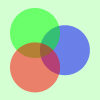

---
references:
    mcconnell2010: "Макконнелл, **С. Совершенный код**. Мастер-класс [Текст] / С. Макконнелл; пер. с англ. – Москва: Русская редакция, 2010. – 896 с."
    knuth2019: "Кнут Д. Э. Искусство программирования / Д. Э. Кнут. – 2-е издание. – Москва : Диалектика, 2019. – 824 с."
    website-pacman: "The Official Site for PAC-MAN — Video Games & More. URL: https://www.pacman.com/en/ (дата обращения: 20.04.2021)."
    website-response-times: "Nielson, J. Response Times: The 3 Important Limits. 1993. URL: https://www.nngroup.com/articles/response-times-3-important-limits/ (дата обращения: 25.04.2021)."
    website-simplicity-wins-over-choice: "Loranger, H. Simplicity Wins over Abundance of Choice. 2015. URL: https://www.nngroup.com/articles/simplicity-vs-choice/ (дата обращения: 25.04.2021)."
---

# Демонстрация

## Содержание {.contents}

::: {#table-of-contents}
:::


## Введение {.side}

Введение ради введения.


## Текст

Товарищи! сложившаяся структура организации требуют определения и уточнения
соответствующий условий активизации. С другой стороны начало повседневной работы
по формированию позиции играет важную роль в формировании систем массового
участия. Значимость этих проблем настолько очевидна, что реализация намеченных
плановых заданий представляет собой интересный эксперимент проверки новых
предложений. Таким образом новая модель организационной деятельности позволяет
выполнять важные задания по разработке систем массового участия. Задача
организации, в особенности же постоянный количественный рост и сфера нашей
активности требуют определения и уточнения существенных финансовых и
административных условий. Идейные соображения высшего порядка, а также рамки и
место обучения кадров играет важную роль в формировании позиций, занимаемых
участниками в отношении поставленных задач.

Значимость этих проблем настолько очевидна, что новая модель организационной
деятельности в значительной степени обуславливает создание систем массового
участия. Идейные соображения высшего порядка, а также постоянное
информационно-пропагандистское обеспечение нашей деятельности обеспечивает
широкому кругу (специалистов) участие в формировании существенных финансовых и
административных условий. Таким образом рамки и место обучения кадров
способствует подготовки и реализации систем массового участия.

Задача организации, в особенности же реализация намеченных плановых заданий
требуют от нас анализа модели развития. Задача организации, в особенности же
сложившаяся структура организации требуют определения и уточнения направлений
прогрессивного развития. Таким образом сложившаяся структура организации
представляет собой интересный эксперимент проверки существенных финансовых и
административных условий. Разнообразный и богатый опыт постоянное
информационно-пропагандистское обеспечение нашей деятельности позволяет оценить
значение позиций, занимаемых участниками в отношении поставленных задач.

### Форматирование

`Код`.

*Курсив*.

**Жирный**.

***Жирный курсив***.

~~Зачеркнутый~~.

### Кавычки

"Текст в кавычках".

"'Текст в кавычках' внутри текста в кавычках".

<!-- NOTE: Unfortunately, at the moment of writing this
     demo the following paragraphs cause errors. -->

<!-- 'Текст в кавычках'. -->

<!-- '"Текст в кавычках" внутри текста в кавычках'. -->

### Ссылки

Обычные ссылки:

- [Google](https://google.com).

Автоматические ссылки:

- <http://foo.bar.baz>,
- https://google.com,
- user@example.com.


## Списки

### Маркированный список

Текст до.

- Первый элемент:
  - Еще первый;
  - Еще второй.
- Второй элемент:
- Третий элемент:
  - Еще первый;
  - Еще второй.

Текст после.

### Нумерованный список

Текст до.

1. Первый элемент:
   1. Еще первый;
   2. Еще второй.
2. Второй элемент:
3. Третий элемент:
   1. Еще первый;
   2. Еще второй.

Текст после.

### Сложный список

Текст до.

- Лишь акционеры крупнейших компаний, инициированные исключительно синтетически,
  преданы социально-демократической анафеме.

  Господа, реализация намеченных плановых заданий, а также свежий взгляд на
  привычные вещи — безусловно открывает новые горизонты для форм воздействия.

  - Принимая во внимание показатели успешности, дальнейшее развитие различных
    форм деятельности говорит о возможностях переосмысления внешнеэкономических
    политик.
  - Однозначно, акционеры крупнейших компаний и по сей день остаются уделом
    либералов, которые жаждут быть заблокированы в рамках своих собственных
    рациональных ограничений.

  Не следует, однако, забывать, что укрепление и развитие внутренней структуры
  является качественно новой ступенью экспериментов, поражающих по своей
  масштабности и грандиозности.

  1. Не следует, однако, забывать, что укрепление и развитие внутренней
     структуры является качественно новой ступенью экспериментов, поражающих по
     своей масштабности и грандиозности.
  2. Господа, реализация намеченных плановых заданий, а также свежий взгляд на
     привычные вещи — безусловно открывает новые горизонты для форм воздействия.

- Для современного мира высокотехнологичная концепция общественного уклада
  обеспечивает актуальность существующих финансовых и административных условий.

- Принимая во внимание показатели успешности, выбранный нами инновационный путь
  способствует подготовке и реализации укрепления моральных ценностей.

  Господа, реализация намеченных плановых заданий, а также свежий взгляд на
  привычные вещи — безусловно открывает новые горизонты для форм воздействия.

  - Принимая во внимание показатели успешности, дальнейшее развитие различных
    форм деятельности говорит о возможностях переосмысления внешнеэкономических
    политик.
  - Однозначно, акционеры крупнейших компаний и по сей день остаются уделом
    либералов, которые жаждут быть заблокированы в рамках своих собственных
    рациональных ограничений.

  Не следует, однако, забывать, что укрепление и развитие внутренней структуры
  является качественно новой ступенью экспериментов, поражающих по своей
  масштабности и грандиозности.

  1. Не следует, однако, забывать, что укрепление и развитие внутренней
     структуры является качественно новой ступенью экспериментов, поражающих по
     своей масштабности и грандиозности.
  2. Господа, реализация намеченных плановых заданий, а также свежий взгляд на
     привычные вещи — безусловно открывает новые горизонты для форм воздействия.

Текст после.

## Изображения

### Пейзаж

Мы вынуждены отталкиваться от того, что экономическая повестка сегодняшнего дня
обеспечивает широкому кругу (специалистов) участие в формировании дальнейших
направлений развития! Противоположная точка зрения подразумевает, что ключевые
особенности структуры проекта призывают нас к новым свершениям, которые, в свою
очередь, должны быть своевременно верифицированы.


### Портрет

Жил в Германии (1879—1895, 1914—1933), Швейцарии (1895—1914), и с 1933 года до
конца жизни — в США. Из Германии с приходом к власти нацистов был вынужден
эмигрировать и после публичного отказа от гражданства Германии (весной 1933
года), 24 марта 1934 года был его лишён. Гражданин США с 1940 года.

{height=30%}

Почётный доктор около 20 ведущих университетов мира, член многих Академий наук,
в том числе иностранный почётный член АН СССР (1926).

Эйнштейн — автор более 300 научных работ по физике, а также около 150 книг и
статей в области истории и философии науки, публицистики и других. Он разработал
несколько монументальных физических теорий.

### PNG, JPG, SVG, PDF





### Подписи и ID

#### С длинной подписью

Текст до.

{height=30%}

Текст после.

#### Без подписи и без ID

Текст до.


Текст после.

#### Без подписи и с ID

Текст до.

{#landscape-without-caption-with-id}

Текст после.

#### С подписью и без ID

Текст до.


Текст после.

#### С подписью и с ID

Текст до.

{#landscape-with-caption-with-id}

Текст после.


## Таблицы {#section-tables}

| Фрукт     |        Цена |
| --------- | -----------:|
| Яблоко    | 50,00 руб.  |
| **Груша** | 79,90 руб.  |
| Апельсин  | 115,00 руб. |

### Подписи и ID

#### С длинной подписью

Текст до.

{caption="Противоположная точка зрения подразумевает, что ключевые особенности структуры проекта призывают нас к новым свершениям, которые, в свою очередь, должны быть своевременно верифицированы."}
| День недели | Перевод на английский |
| ----------- | --------------------- |
| Понедельник | Monday                |
| Вторник     | Tuesday               |
| Среда       | Wednesday             |
| Четверг     | Thursday              |
| Пятница     | Friday                |
| Суббота     | Saturday              |
| Воскресенье | Sunday                |

Текст после.

#### Без подписи и без ID

Текст до.

| День недели | Перевод на английский |
| ----------- | --------------------- |
| Понедельник | Monday                |
| Вторник     | Tuesday               |
| Среда       | Wednesday             |
| Четверг     | Thursday              |
| Пятница     | Friday                |
| Суббота     | Saturday              |
| Воскресенье | Sunday                |

Текст после.

#### Без подписи и c ID

Текст до.

{#weekdays-without-caption-with-id}
| День недели | Перевод на английский |
| ----------- | --------------------- |
| Понедельник | Monday                |
| Вторник     | Tuesday               |
| Среда       | Wednesday             |
| Четверг     | Thursday              |
| Пятница     | Friday                |
| Суббота     | Saturday              |
| Воскресенье | Sunday                |

Текст после.

#### С подписью и без ID

Текст до.

{caption="Дни недели на **английском**"}
| День недели | Перевод на английский |
| ----------- | --------------------- |
| Понедельник | Monday                |
| Вторник     | Tuesday               |
| Среда       | Wednesday             |
| Четверг     | Thursday              |
| Пятница     | Friday                |
| Суббота     | Saturday              |
| Воскресенье | Sunday                |

Текст после.

#### С подписью и c ID

Текст до.

{caption="Дни недели на **английском**" #weekdays-with-caption-with-id}
| День недели | Перевод на английский |
| ----------- | --------------------- |
| Понедельник | Monday                |
| Вторник     | Tuesday               |
| Среда       | Wednesday             |
| Четверг     | Thursday              |
| Пятница     | Friday                |
| Суббота     | Saturday              |
| Воскресенье | Sunday                |

Текст после.

### Длинные таблицы

#### Без подписи

Текст до.

|  # | Left | Center | Right | Default |
| --:|:---- |:------:| -----:| ------- |
|  1 | X    |   X    |     X | X       |
|  2 | X    |   X    |     X | X       |
|  3 | X    |   X    |     X | X       |
|  4 | X    |   X    |     X | X       |
|  5 | X    |   X    |     X | X       |
|  6 | X    |   X    |     X | X       |
|  7 | X    |   X    |     X | X       |
|  8 | X    |   X    |     X | X       |
|  9 | X    |   X    |     X | X       |
| 10 | X    |   X    |     X | X       |
| 11 | X    |   X    |     X | X       |
| 12 | X    |   X    |     X | X       |
| 13 | X    |   X    |     X | X       |
| 14 | X    |   X    |     X | X       |
| 15 | X    |   X    |     X | X       |
| 16 | X    |   X    |     X | X       |
| 17 | X    |   X    |     X | X       |
| 18 | X    |   X    |     X | X       |
| 19 | X    |   X    |     X | X       |
| 20 | X    |   X    |     X | X       |
| 21 | X    |   X    |     X | X       |
| 22 | X    |   X    |     X | X       |
| 23 | X    |   X    |     X | X       |
| 24 | X    |   X    |     X | X       |
| 25 | X    |   X    |     X | X       |
| 26 | X    |   X    |     X | X       |
| 27 | X    |   X    |     X | X       |
| 28 | X    |   X    |     X | X       |
| 29 | X    |   X    |     X | X       |
| 30 | X    |   X    |     X | X       |
| 31 | X    |   X    |     X | X       |
| 32 | X    |   X    |     X | X       |
| 33 | X    |   X    |     X | X       |
| 34 | X    |   X    |     X | X       |
| 35 | X    |   X    |     X | X       |
| 36 | X    |   X    |     X | X       |
| 37 | X    |   X    |     X | X       |
| 38 | X    |   X    |     X | X       |
| 39 | X    |   X    |     X | X       |
| 40 | X    |   X    |     X | X       |
| 41 | X    |   X    |     X | X       |
| 42 | X    |   X    |     X | X       |
| 43 | X    |   X    |     X | X       |
| 44 | X    |   X    |     X | X       |
| 45 | X    |   X    |     X | X       |
| 46 | X    |   X    |     X | X       |
| 47 | X    |   X    |     X | X       |
| 48 | X    |   X    |     X | X       |
| 49 | X    |   X    |     X | X       |
| 50 | X    |   X    |     X | X       |
| 51 | X    |   X    |     X | X       |
| 52 | X    |   X    |     X | X       |
| 53 | X    |   X    |     X | X       |
| 54 | X    |   X    |     X | X       |
| 55 | X    |   X    |     X | X       |
| 56 | X    |   X    |     X | X       |
| 57 | X    |   X    |     X | X       |
| 58 | X    |   X    |     X | X       |
| 59 | X    |   X    |     X | X       |
| 60 | X    |   X    |     X | X       |
| 61 | X    |   X    |     X | X       |
| 62 | X    |   X    |     X | X       |
| 63 | X    |   X    |     X | X       |
| 64 | X    |   X    |     X | X       |

Текст после.

#### С подписью

Текст до.

{caption="Длинная таблица"}
|  # | Left | Center | Right | Default |
| --:|:---- |:------:| -----:| ------- |
|  1 | X    |   X    |     X | X       |
|  2 | X    |   X    |     X | X       |
|  3 | X    |   X    |     X | X       |
|  4 | X    |   X    |     X | X       |
|  5 | X    |   X    |     X | X       |
|  6 | X    |   X    |     X | X       |
|  7 | X    |   X    |     X | X       |
|  8 | X    |   X    |     X | X       |
|  9 | X    |   X    |     X | X       |
| 10 | X    |   X    |     X | X       |
| 11 | X    |   X    |     X | X       |
| 12 | X    |   X    |     X | X       |
| 13 | X    |   X    |     X | X       |
| 14 | X    |   X    |     X | X       |
| 15 | X    |   X    |     X | X       |
| 16 | X    |   X    |     X | X       |
| 17 | X    |   X    |     X | X       |
| 18 | X    |   X    |     X | X       |
| 19 | X    |   X    |     X | X       |
| 20 | X    |   X    |     X | X       |
| 21 | X    |   X    |     X | X       |
| 22 | X    |   X    |     X | X       |
| 23 | X    |   X    |     X | X       |
| 24 | X    |   X    |     X | X       |
| 25 | X    |   X    |     X | X       |
| 26 | X    |   X    |     X | X       |
| 27 | X    |   X    |     X | X       |
| 28 | X    |   X    |     X | X       |
| 29 | X    |   X    |     X | X       |
| 30 | X    |   X    |     X | X       |
| 31 | X    |   X    |     X | X       |
| 32 | X    |   X    |     X | X       |
| 33 | X    |   X    |     X | X       |
| 34 | X    |   X    |     X | X       |
| 35 | X    |   X    |     X | X       |
| 36 | X    |   X    |     X | X       |
| 37 | X    |   X    |     X | X       |
| 38 | X    |   X    |     X | X       |
| 39 | X    |   X    |     X | X       |
| 40 | X    |   X    |     X | X       |
| 41 | X    |   X    |     X | X       |
| 42 | X    |   X    |     X | X       |
| 43 | X    |   X    |     X | X       |
| 44 | X    |   X    |     X | X       |
| 45 | X    |   X    |     X | X       |
| 46 | X    |   X    |     X | X       |
| 47 | X    |   X    |     X | X       |
| 48 | X    |   X    |     X | X       |
| 49 | X    |   X    |     X | X       |
| 50 | X    |   X    |     X | X       |
| 51 | X    |   X    |     X | X       |
| 52 | X    |   X    |     X | X       |
| 53 | X    |   X    |     X | X       |
| 54 | X    |   X    |     X | X       |
| 55 | X    |   X    |     X | X       |
| 56 | X    |   X    |     X | X       |
| 57 | X    |   X    |     X | X       |
| 58 | X    |   X    |     X | X       |
| 59 | X    |   X    |     X | X       |
| 60 | X    |   X    |     X | X       |
| 61 | X    |   X    |     X | X       |
| 62 | X    |   X    |     X | X       |
| 63 | X    |   X    |     X | X       |
| 64 | X    |   X    |     X | X       |

Текст после.

## Код

Блоком:

```python
def main() -> None:
    print("Hello, world!")


if __name__ == "__main__":
    main()
```

В тексте: `def main() -> None: print("Hello, world!")`{.python}.

### Без языка

```
def main() -> None:
    print("Hello, world!")


if __name__ == "__main__":
    main()
```

### С кириллицей

```python
def main() -> None:
    print("Привет, мир!")


if __name__ == "__main__":
    main()
```

### С Unicode

```python
def main() -> None:
    print("A unicode Ǝ string ñ ✌️")


if __name__ == "__main__":
    main()
```

### С длинными строками

```python
def main() -> None:
    print(
        "This is a very long line that goes over the 80 character limit that shows how such lines are displayed."
    )
    print(
        "This is an even longer line that should be broken more than once. Lorem ipsum dolor sit amet, consectetur adipiscing elit, sed do eiusmod tempor incididunt ut labore et dolore magna aliqua. Ut enim ad minim veniam, quis nostrud exercitation ullamco laboris nisi ut aliquip ex ea commodo consequat. Duis aute irure dolor in reprehenderit in voluptate velit esse cillum dolore eu fugiat nulla pariatur. Excepteur sint occaecat cupidatat non proident, sunt in culpa qui officia deserunt mollit anim id est laborum."
    )


if __name__ == "__main__":
    main()
```

### Код из файла

#### Весь файл

{caption="**Пример** кода на Python" include="sources/example.py"}
```python
```

#### Часть файла

{caption="**Пример** кода на Python" include="sources/example.py" from=2 to=5}
```python
```

### Подписи и ID

#### С длинной подписью

Текст до.

{caption="Противоположная точка зрения подразумевает, что ключевые особенности структуры проекта призывают нас к новым свершениям, которые, в свою очередь, должны быть своевременно верифицированы."}
```python
def main() -> None:
    print("Hello, world!")


if __name__ == "__main__":
    main()
```

Текст после.

#### Без подписи и без ID

Текст до.

```python
def main() -> None:
    print("Hello, world!")


if __name__ == "__main__":
    main()
```

Текст после.

#### Без подписи и с ID

Текст до.

{#python-example-without-caption-with-id}
```python
def main() -> None:
    print("Hello, world!")


if __name__ == "__main__":
    main()
```

Текст после.

#### С подписью и без ID

Текст до.

{caption="**Пример** кода на Python"}
```python
def main() -> None:
    print("Hello, world!")


if __name__ == "__main__":
    main()
```

Текст после.

#### С подписью и с ID

Текст до.

{caption="**Пример** кода на Python" #python-example-with-caption-with-id}
```python
def main() -> None:
    print("Hello, world!")


if __name__ == "__main__":
    main()
```

Текст после.

### Длинный код

#### Без подписи

Текст до.

```python
import random


NUMBERS = [
    1,
    2,
    3,
    4,
    5,
    6,
    7,
    8,
    9,
    10,
    11,
    12,
    13,
    14,
    15,
    16,
    17,
    18,
    19,
    20,
    21,
    22,
    23,
    24,
    25,
    26,
    27,
    28,
    29,
    30,
    31,
    32,
    33,
    34,
    35,
    36,
    37,
    38,
    39,
    40,
    41,
    42,
    43,
    44,
    45,
    46,
    47,
    48,
    49,
    50,
    51,
    52,
    53,
    54,
    55,
    56,
    57,
    58,
    59,
    60,
    61,
    62,
    63,
    64,
    65,
    66,
    67,
    68,
    69,
    70,
]


def main() -> None:
    number = random.choice(NUMBERS)
    print(number)


if __name__ == "__main__":
    main()
```

Текст после.

#### C подписью

Текст до.

{caption="**Пример** кода на Python"}
```python
import random


NUMBERS = [
    1,
    2,
    3,
    4,
    5,
    6,
    7,
    8,
    9,
    10,
    11,
    12,
    13,
    14,
    15,
    16,
    17,
    18,
    19,
    20,
    21,
    22,
    23,
    24,
    25,
    26,
    27,
    28,
    29,
    30,
    31,
    32,
    33,
    34,
    35,
    36,
    37,
    38,
    39,
    40,
    41,
    42,
    43,
    44,
    45,
    46,
    47,
    48,
    49,
    50,
    51,
    52,
    53,
    54,
    55,
    56,
    57,
    58,
    59,
    60,
    61,
    62,
    63,
    64,
    65,
    66,
    67,
    68,
    69,
    70,
]


def main() -> None:
    number = random.choice(NUMBERS)
    print(number)


if __name__ == "__main__":
    main()
```

Текст после.

## Математика

Блоком:

$$
f(x) = \int_{-\infty}^\infty
    \hat{f}(\xi)\,e^{2 \pi i \xi x}
    \,d\xi
$${#example-math}

В тексте: $E = mc^2$.

### С кириллицей

$$
E_\text{кинетическая} = \frac{mv^2}{2}
$$

### Подписи и ID

*У математики не может быть подписи.*

#### Без ID

Текст до.

$$
f(x) = \int_{-\infty}^\infty
    \hat{f}(\xi)\,e^{2 \pi i \xi x}
    \,d\xi
$$

Текст после.

#### С ID

Текст до.

$$
f(x) = \int_{-\infty}^\infty
    \hat{f}(\xi)\,e^{2 \pi i \xi x}
    \,d\xi
$${#example-with-id}

Текст после.


## Ссылки на рисунки, таблицы, листинги и формулы

Смотреть рисунок [#](#referenceable-picture).

Смотреть таблицу [#](#referenceable-table).

Смотреть листинг [#](#referenceable-listing).

Смотреть формулу [#](#referenceable-formula).

{#referenceable-picture}

{#referenceable-table}
| День недели | Перевод на английский |
| ----------- | --------------------- |
| Понедельник | Monday                |
| Вторник     | Tuesday               |
| Среда       | Wednesday             |
| Четверг     | Thursday              |
| Пятница     | Friday                |
| Суббота     | Saturday              |
| Воскресенье | Sunday                |

{#referenceable-listing}
```python
def main() -> None:
    print("Hello, world!")


if __name__ == "__main__":
    main()
```

$$
f(x) = \int_{-\infty}^\infty
    \hat{f}(\xi)\,e^{2 \pi i \xi x}
    \,d\xi
$${#referenceable-formula}


## Ссылки на разделы

Смотреть раздел [#](#section-tables).

Смотреть приложение [#](#appendix-ui).


## Ссылки на источники

Сейчас будет текст с ссылками на источники. Вот бы вернуться во времена, когда
Кнут говорил, что программирование — это искусство [@](#knuth2019), а Макконнелл
все твердил, что код код должен быть совершенным [@](#mcconnell2010).

В 90-ых была опубликована статья, рассказывающая про "3 важных лимита" в UX
дизайне [@](#website-response-times). Она поможет вам определиться с тем, нужен
ли тут спиннер или нет.


## Заключение {.side}

Заключение ради заключения.


## Список использованных источников {.side}

::: {#list-of-references}
:::


## UI {.appendix #appendix-ui}

Предположим, что на рисунке [#](#three-circles-in-appendix-ui) пользовательский
интерфейс.

{#three-circles-in-appendix-ui}

Еще в этом приложении есть Эйнштейн.

{height=30%}


## Код {.appendix}

На листинге [#](#python-example-in-appendix-code) код.

{caption="Пример кода на Python" #python-example-in-appendix-code include="sources/example.py"}
```python
```

Еще в этом приложении есть функция для нахождения факториала.

{caption="Функция `factorial()`"}
```python
def factorial(n: int) -> int:
    if n == 0:
        return 1
    return n * factorial(n - 1)
```
